现在是 5 月 10 日，距离 4 月 24 日出门已经过去了半个月。

其实早该写了。

只是这次不像湘潭那样，有什么东西在凌晨四点半把我击穿。这趟玩得很开心，开心到回来之后反而没什么动力写。

伤感会自己留下伤口，快乐却没那么令人深刻，给人带来错觉，好似这种快乐唾手可得，好似表演永不落幕。

但想了想，还是得写。

## 起因

直接原因是之前报名了[一场比赛](https://www.moonbitlang.cn/2026-scc)，他们在 25 号去深圳的线下活动领奖。说到这个比赛，我本来是想赛后把[我的作品](https://github.com/KeqingMoe/qt.mbt)里面用到的技术写篇文章的，但只拿了个最低的奖，也没有人用，所以就不写了。

不过就算没有比赛，我也要出去玩，无非就是不一定去深圳。

[湘潭三日](/blog/back-from-xiangtan)使我惊觉，决心做自己，决心珍惜青春。这次带上了焦茶、rkk 还有军✌️。其实还有两个群友也想来，但他们都没空。其中有一位的事到了当天却因其他活动取消了，令人唏嘘。这也是不幸吧。

## 出发

湘潭那次好几个人都 dress 了，我没带东西真是可惜。所以这次我直接 dress 出发！人生第一次伪街，有点紧张。

脚踩一双乐福鞋，重心微前倾，身体不由得挺直。此时的我接近 1m8，高出同行的伙伴们一大截。

我们是 24 号那天傍晚出发，刚好又在下雨，感觉下半身有点凉凉的。不过比热好太多了，不喜欢穿那么可爱的我热成条狗，出汗还会把衣服弄脏（虽然最后还是弄脏了，25 号晚上躺床上没脱女装不小心睡着，醒来热热的身上有些汗）。

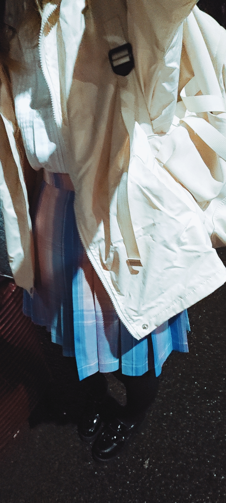

先打车去接人，直接去高铁站。坐高铁去深圳，几乎没用多久，感觉还没坐稳就要下车了。现在的基础设施真是好啊。我还记得小时候坐火车，开票检票过安检进站过闸机上车都要和人交互，车上还有人查票；现在全部都是机器，我一句话都不用说，甚至口罩都不用摘。拜基础设施所赐，像我这样不会伪音的也能伪街了。

可惜，不知道为啥拍不出我的大长腿，总是感觉照片里的我腿好短呜呜呜。

刚下高铁那会高铁站有很多人，大概是因为周五吧。他们说经过的人有很多盯着我的腿看 hhh。不低的身高且身着女装，穿着裤袜的细长双腿，脚上踏出清脆的声音，确实很难不让人注意。我感觉好自信，被大家欣赏了好开心。

接着高铁转地铁，去我们订的酒店。我发现，深圳的站名比起广州要朴素很多，大多是些“南山”、“桃园”、“上川”、“黄田”等。

### 小雨

下地铁出站，已经是大约九点左右。外面下着小雨，温度低到可以用冷形容，不过腿上其实还挺舒服的。

走了大约两三百米左右，到了住处。伙伴们的脚步勾起了一些水，溅到他们自己身上。而我优雅的步伐不惊起一丝水花！不过最后还是不慎勾了一点到袜子上 QAQ。

尽管要小心滑倒和水溅到袜子上，我还是挺喜欢这种天气的。雨天，不大，很凉快，有一点微风。如果是白天那就更好了，被积雨云覆盖着，不亮也不暗。如果我有非常多女装和袜子，伪街相当于日常且无需多么珍惜，那我也会喜欢在大一些的雨中出门的。

我实在是太喜欢雨天了。我的网名/笔名是時雨てる；最喜欢的歌是《世末歌者》；有好多把伞；玩《异环》时总是要调到雨天；读到“醉后不知天在水，满船清梦压星河”我会觉得这一定是一个刚刚停雨的夜晚。到了雨天我的心情就会非常愉悦，且难以用言语表达，读者们请把你感受到的喜爱放大十倍。

雨之外的气象，我亦十分钟爱。听说新海诚在创作《天气之子》之前，就已经是一位天气之子了[^1]，我感觉我也有点像？我甚至想过在我的 blog 上留一块小小的空间，亲自记录和观察气象，可惜最终还是没做。

### 入住

酒店还不错。出发之前 rkk 挑酒店挑了很久来着，似乎是由于这个线下活动的地点有点不太好，他们也没报销（实际上由于我也不是住单人，所以也没报销）得省点钱。

来之前没吃晚饭，外卖点了些烧烤来吃。我们在 rkk 和军✌️房间里吃烧烤、打游戏，还挺惬意的。我在《异环》里面给军✌️展示车技，焦茶奴役 atri 娃娃打崩铁。

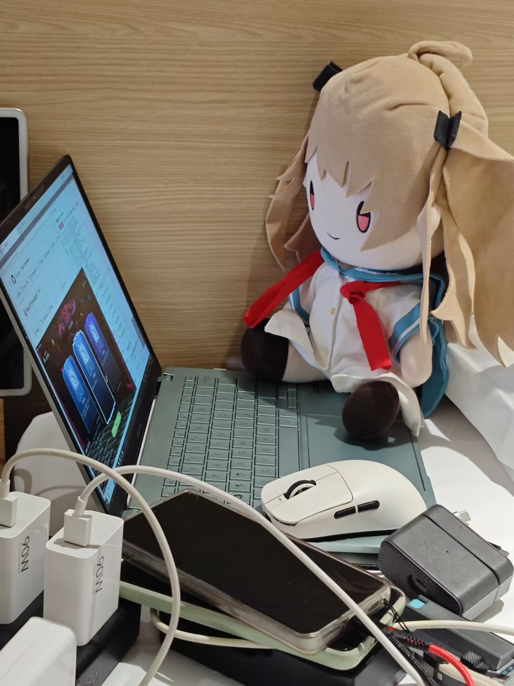

到了四点，大家各回各房睡觉。我有点睡不着，忙点事情。半夜饿了，准备外卖再点个烧烤，挑挑选选到了五点人家下班了。最后在麦当劳点了一份超量（远超我俩的量）的早餐。

六点多早餐送到了，我吃了我的份，睡了大约一个小时。也可能我记错了，其实没睡。

熬夜真是不好，我的作息已经乱了很久了，以至于五一假期几乎就是美国时区，但我控制不住。也许可以去美国住个一周把时差再熬个半天再回来。

其实我也不想熬夜，对皮肤很不好。如果一天有 48 小时该多好啊，总是觉得自己好忙好忙好忙，就连忙里偷闲的时间也会不自主地忙。好像这样忙下去，就能从睡眠中压榨出更多时间。高中的我确实是可以的，那时候我还秉持着“假期睡觉就是浪费时间”的理念，不过那是后话了，之后有空再专门写吧。然而有效工作时间不以人的意志转移，我在晚上多忙了会，白天就会变得低效或者睡着，并且凭空对身体造成了损害。所以为什么明知不好还要熬夜呢？不知道，可能只有 DeepSeek 老师知道[^2]。就连这篇文章也是熬夜写的，10 号凌晨写一会，11 号凌晨再写一会。

## 活动

早上八点起床了。剩下的早餐实在是太多了，给 rkk 和军✌️也拿去了。这么说来我可能半夜吃得有点多了，如果少吃点也许够四个人吃？

本来是想 dress 着去的，但是担心会热，另一方面活动和领奖要和人交互，还是有点不敢。

下楼出发去地铁站，这段路在白天反着走竟然令我有些不错的感觉，说不清为什么。

其实感觉很抱歉，明明是我自己的事情却拉着大家一起来活动现场坐牢，他们除了享用茶歇并没有得到什么好处。规划行程前我跟他们说，如果你们没兴趣的话可以出去玩，等活动结束了我们再汇合，但他们还是和我一起参加活动。

来到一个叫 G&G 创意社区的地方，活动就在这里。

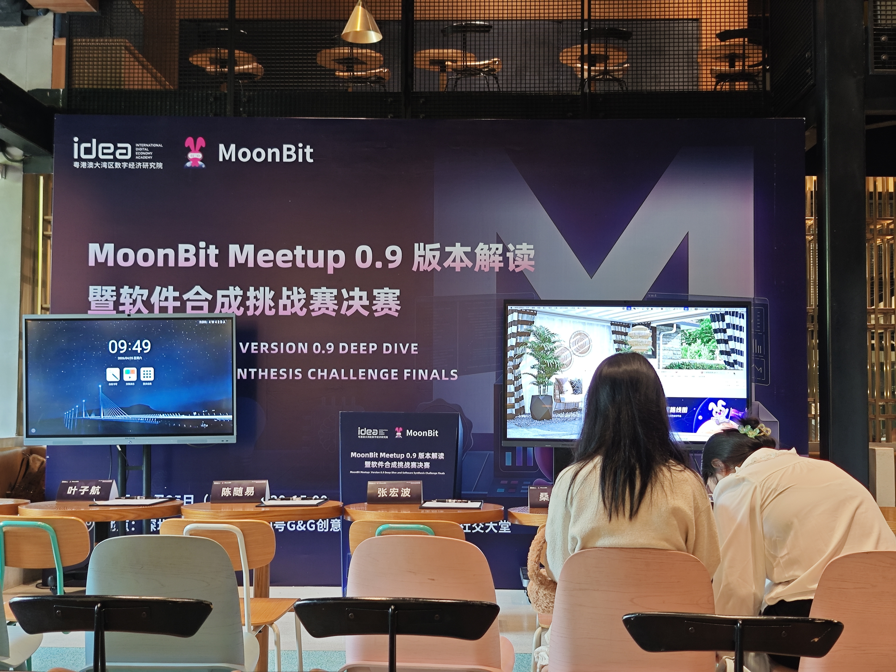

活动是 10:30 开始，10 点整到场签到，我们刚好在 10 点到，是最早来的几个人。挑了后排落座。

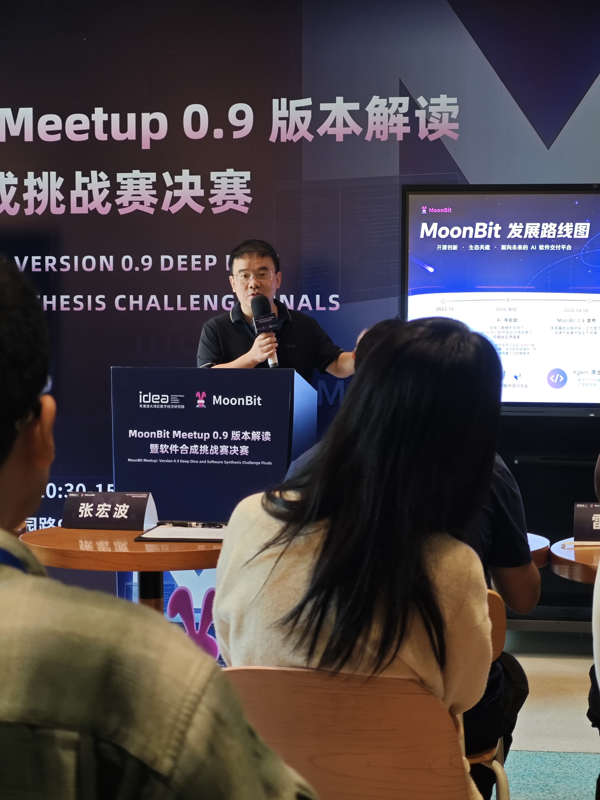

答辩选手们的作品各有千秋，有一个做 galgame 的特别搞笑，评委还跟他说“我对你这个‘二次元’很感兴趣”，笑死。

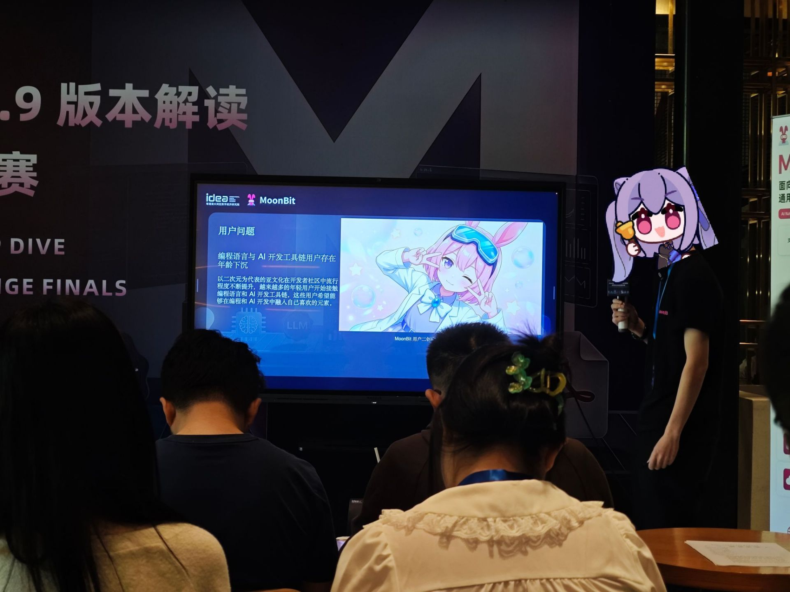

中间有茶歇，他们去吃了。可惜那会我已经困得不行，几乎睡着了。

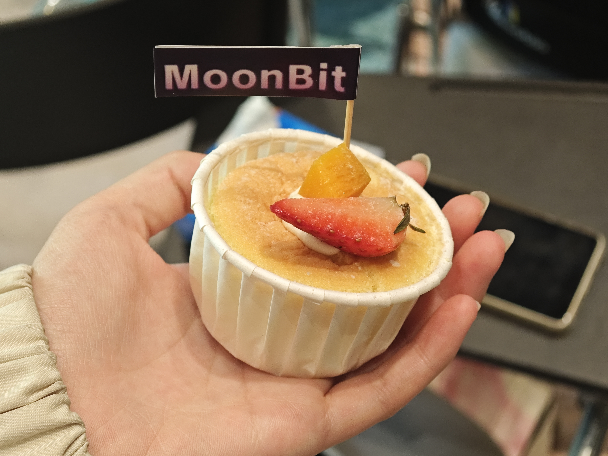

中间出去吃了个饭，回来接着听。完事了大家一起上去合影喊口号，作为选手的我领了一件纪念衬衫。

## 下午接着玩

大家出来接着玩，去深圳湾万象城逛商场。这里 plmm 真的好多，不过感觉我弄弄头发再化个妆的话也不差于她们！

逛啊逛也不知道逛什么，也没什么值得记录的，逛商场大概就是这样吧，但是还挺好逛的。

快到饭点了，找了个萨莉亚去吃。四个人竟然只吃了 86（后来回学校了两个人就吃了五六十！），而且还能吃饱，还挺好吃。我还寻思有点少，要不加点菜。rkk 点了个墨鱼汁意面，吃得满嘴石油，还好我不敢点这个。

吃完饭大家坐地铁回住处。其实本来准备去隔壁人才公园逛逛，可是军✌️中间临时刷新课表发现明天有课，不得不提早回去，真是可惜。

中间有一段临时停车，刚好窗外有红色的广告，显得非常恐怖，像世界末日一样。

这画面要是出现在惊悚片里，下一秒就该有东西趴到窗户上敲玻璃了。不过如果不是 rkk 拍到了，我都发现不了，看来我果然没有摄影天赋，高考完买了影像旗舰还想着多学学拍照，唉。

## dress! 夜遊び

睡了会，八点左右起床下去逛。凉爽的晚上是适合 dress 的。

酒店附近有个万达。穿过跳广场舞的大妈和小孩，直接进入。

到了一家不知道什么店，买了个蝴蝶结夹子：

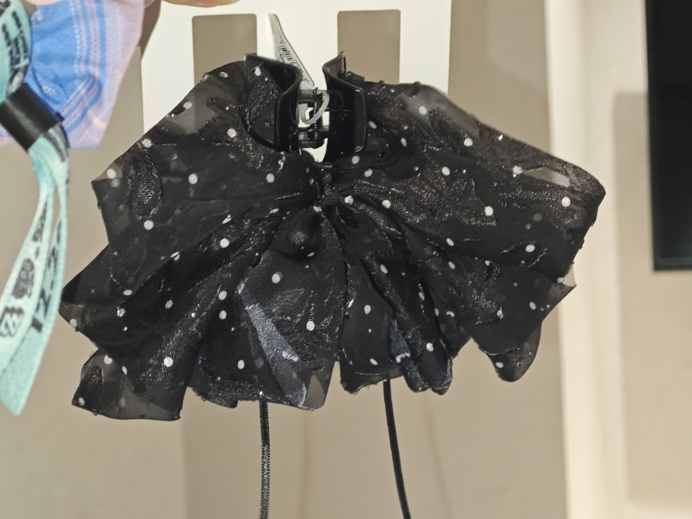

还看到一个牌子上面写着顺德佬，笑死。

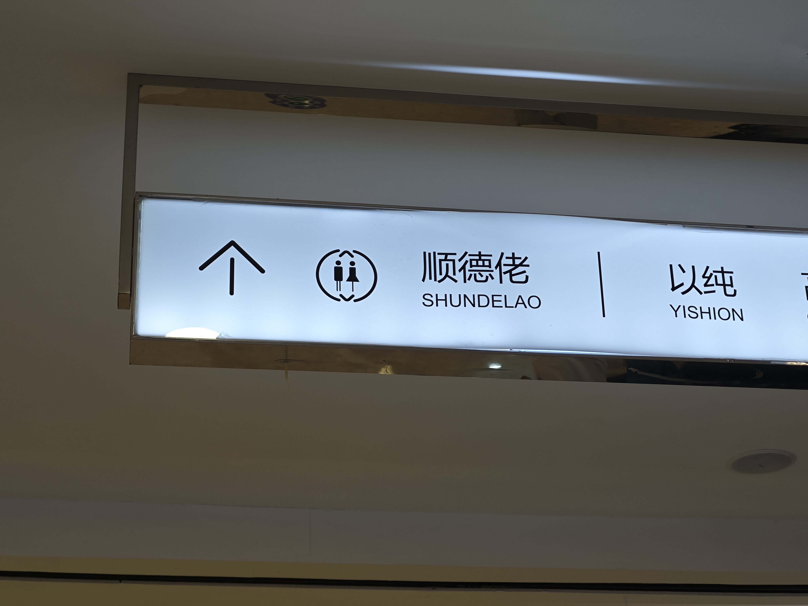

逛得差不多了就回去了。

不过这次出来倒是让我更细致地享受走路的感觉。

走路的时候，裤袜给腰、臀、裆、腿、足带来的包裹感更甚于在家或者静止不动时，鞋子给我的支撑让我感觉脚下有点不踏实，但是我的步伐踏起来又完全很稳很舒适，不会慌张或者害怕摔倒。我还试着跑了几步，依旧很稳，就像有充足的伪街经验那样。

可能走得有点久了，脚有点疼，这鞋 39 码，码数刚好，但宽度可能有点不够。

## 次元小镇

早上起来，先下楼退房，寄存行李。今天的行程是先打车去次元小镇，接着再去壹方城。

由于担心会热，而且很快就要回家了，就不 dress 了。

打车过去，刚开始的路很窄很堵，才注意到酒店周围的房子稍显破败。开到大道上突然就变得很宽敞，也能看到高楼大厦了。联想到之前的地铁站名，或许这就是发展过快导致的后果。

到附近之后，看到一辆 Eva 痛车：

进入地下，来到（二）次元小镇！

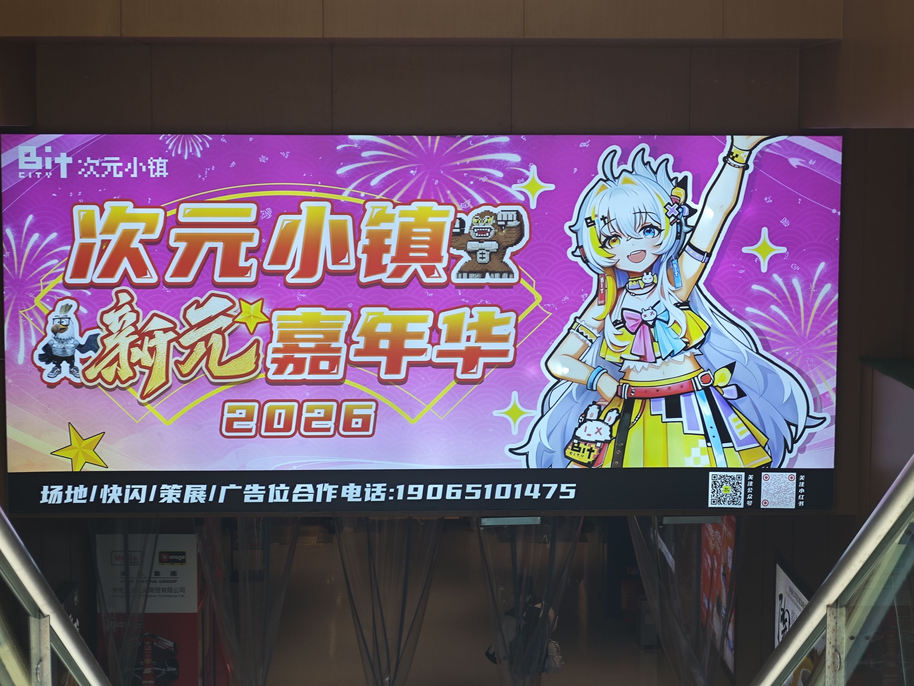

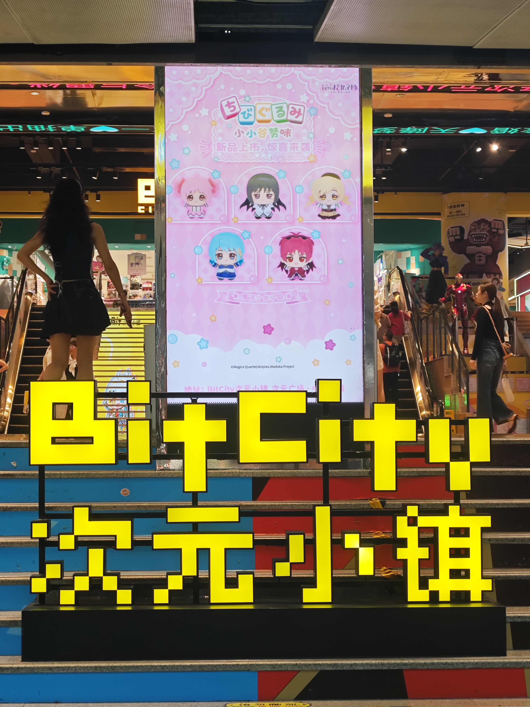

这里面 coser 非常多，不过不敢拍。还有很多谷子店。

先点杯喜茶喝喝。几个月前出去玩的时候画了一个 nekobox 的贴纸，要审核所以没法当场点，现在才终于点到一次。

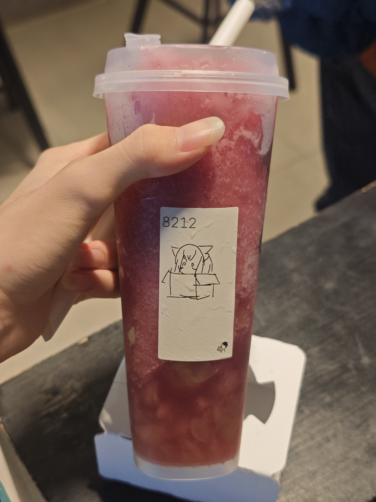

点了之后到附近逛逛，看到一家女装店，里面卖的衣服挺好看的。焦茶临时要去上个厕所，我和 rkk 找了个地方坐着看旁边小朋友打太鼓达人。

人齐之后，逛逛逛买买买启动！焦茶买了很多，我只买了两个斯科特的吧唧和一本讲新海诚的书（谁逛谷店买书啊喂），之前还买过一本《你的名字。》原画集，不过从来没看过，这本估计也是了。

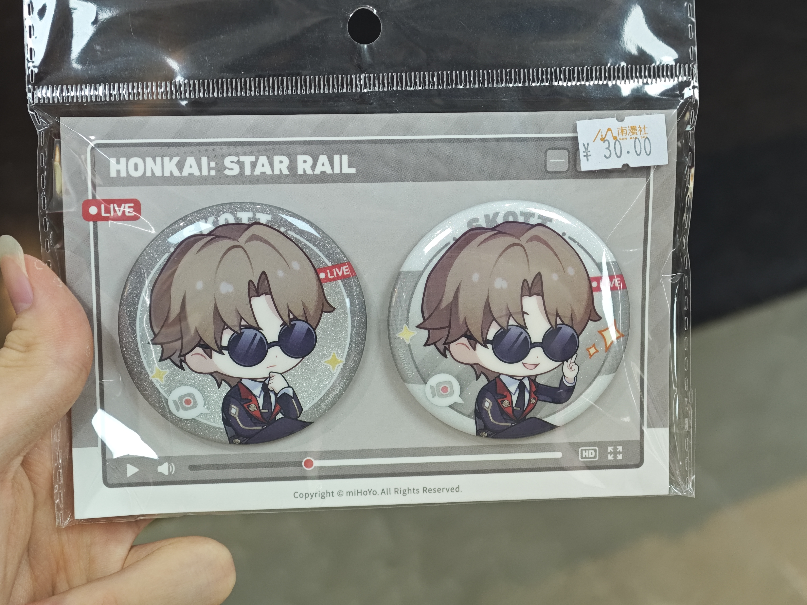

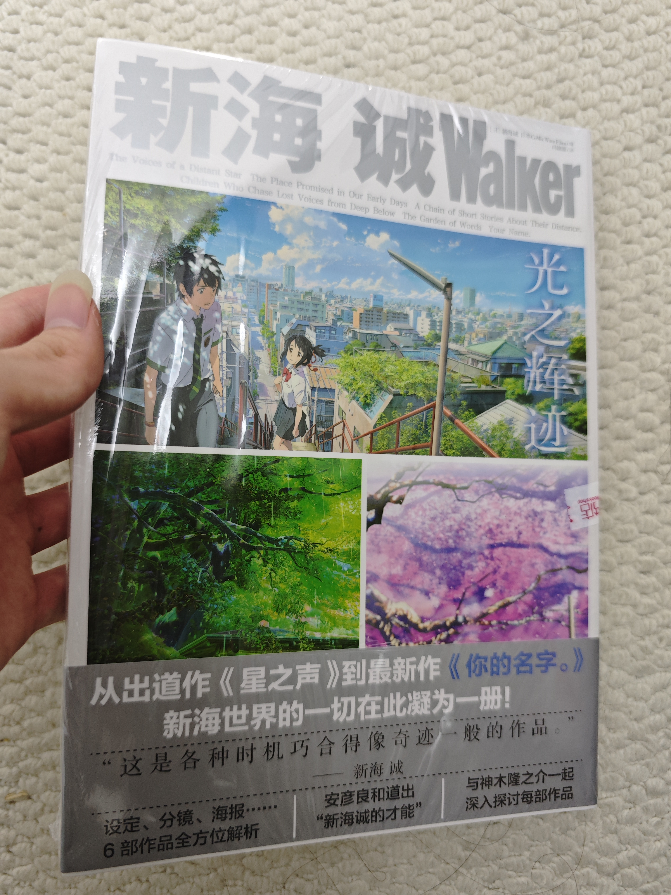

在一家扭蛋机店里面看到贴得满满的贴纸墙：

店里的扭蛋千奇百怪。有这种抽录音机的，甚至还标明了可以录音（也有别的机器标不能录音的），还有能当袜子用的杯套，简直神秘。

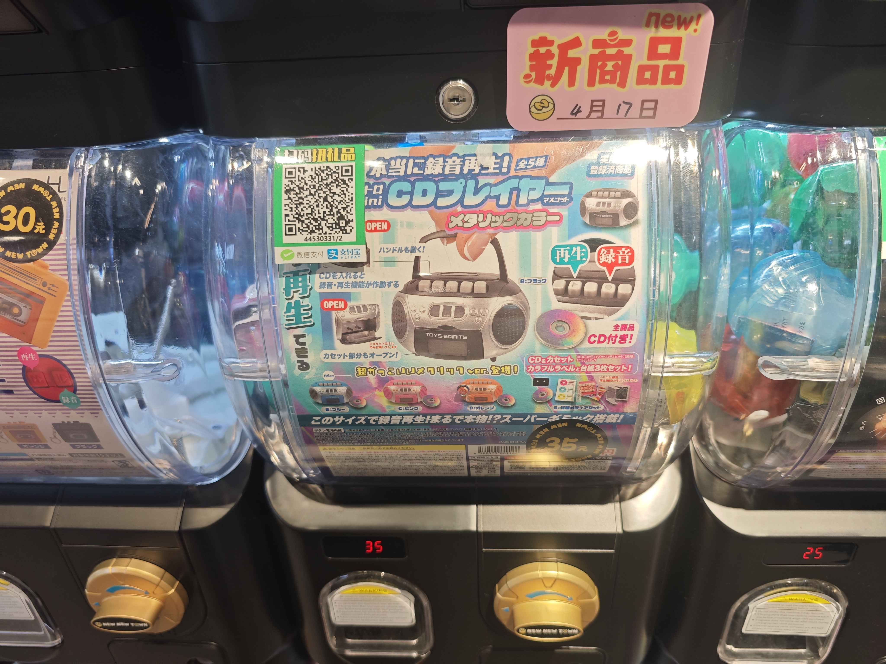

逛到了一家店主很喜欢钟离的谷店：

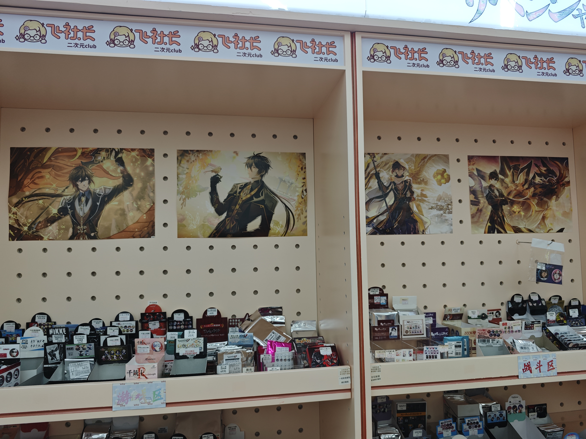

逛了一圈回到起点，看到有墙上用丙烯颜料手绘的希儿。想起来曾经试着学画画，把透视看了个七七八八就抛之脑后了，其实也是太忙了。

又看到贴纸墙，不过这次全是画了：

又到一家谷子店，一个格子里面全是爱莉，感觉崩坏三比想象中要火一些？

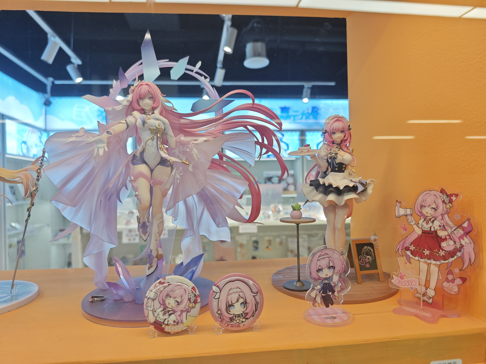

还有一个格子里面是一些我不认识的作品的周边，但是看起来非常可爱，之后可能有兴趣去看一下。

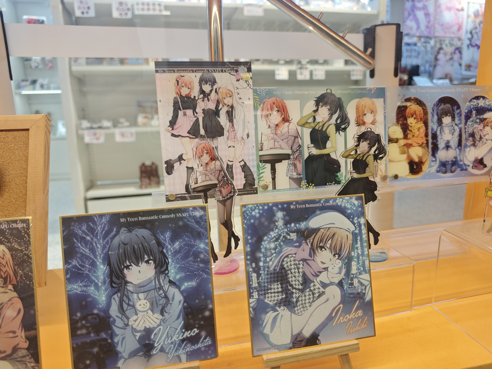

这家店里面还有那啥俄语同桌，不过我实在是看不下去那部，第一话剧情看了十秒钟就给我气得退出了。而且它贴墙上的女主的画，上面的动作真的不好看。

在另一家店还看到一个特别搞笑的，我也不知道是啥：

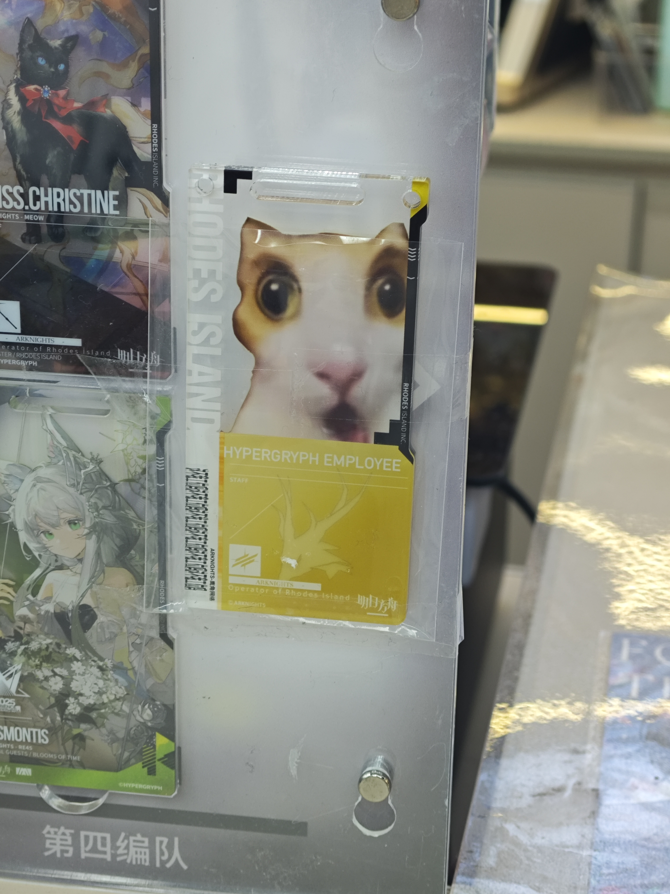

不知不觉逛了好久了，到饭点了，在次元小镇里面的麦当劳解决。已经没时间去壹方城了，其实也是早上起晚了导致的呜呜。

## 返程

吃麦吃到一半突然意识到已经不早了，得争分夺秒回去拿行李，然后赶地铁去高铁站。

真是起晚了，我们已经要赶不上了，结果非常巧合地高铁晚点了。

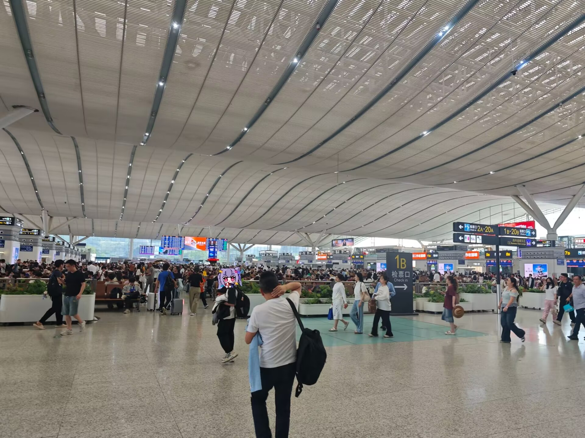

再见深圳，回家啦。

## 尾声

大一暑假那会我还和我妈说那可能是我唯一一个暑假，大三暑假得去实习，甚至可能大二暑假就得去。原来悲伤的种子早在那时就已埋下了，也可能更早而我不自知。

但正因我悲伤，更显得深圳三日的快乐了。回来之后我没哭，也没有怅然若失。

所以我写不出东西，拖延了这么久。写出来也远远不及上一篇。我听说，真正的写作只有一种来源，生命中的某个部分太疼了，疼到你必须喋喋不休地回应它。

但正因为它太开心，才更应该写下来。伤心的事不用记也会记得，快乐的事若不写，很快就会变成“那天好像玩得挺开心”的一句话。

我写了 10 号凌晨，11 号凌晨，还有今天（14 号）凌晨，才终于把它写完。算下来，今天其实是写得最多的。

可是当真不痛么，今天我半夜又哭了。虽然不是为了深圳三日，却让我彻夜难眠。我决心做自己的决定，想来想去也和这次伪街有几分关联。就凭这个，哪怕决定 12 号起不熬夜了，也得破例通宵一次，把它写完。

这次真的要下决心了，从现在开始，为了自己，为了青春，健康生活。当然也为了做自己，寻求一些改变。此中自然有深意，我且先按下不表，今后做出行动时再来追加。

[^1]: [为《天气之子》一辩](https://movie.douban.com/review/15057831/)
[^2]: [熬夜心理矛盾解析 - DeepSeek](https://chat.deepseek.com/share/sj12kbcmj2gd70arqq)
