现在是 4 月 20 日，周一，早上四点半。寤寐无为，涕泗滂沱。遂趁着记忆清晰，写下这篇文章，锚定我所剩无几的青春。

## 出发去比赛

大约是上个月吧，某场 CTF 比赛，我们队进了线下。~~虽然我和 LSJGP 在赛后才知道我报了名（对不起我是混子）。~~

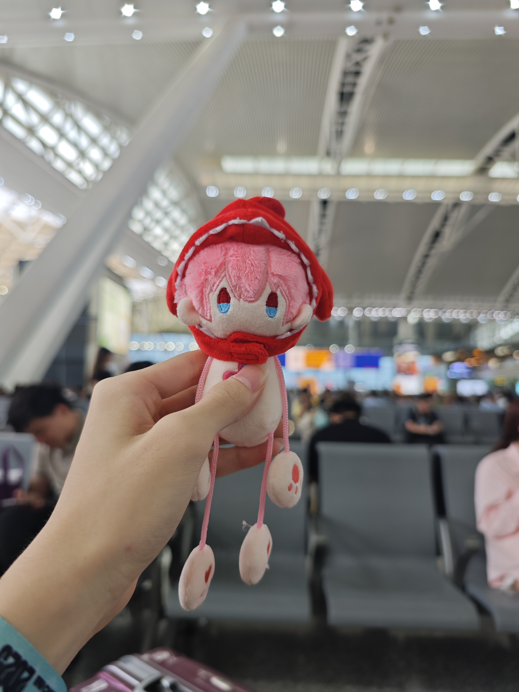

4 月 17，周五。带上某人的三月七，行李箱里还塞了一只 Atri。出发喽！

上次像这样出省应该还是上大学之前的暑假了，那次是最后一次回江西。以前总是盼望着坐火车回去，成年了反而没再去过了。

于是，铁路和站台成了我童年中最重要的东西。井冈山站的模样清晰地刻在我记忆中，小学的时候做梦也会梦到车站顶上的大波浪形建筑出现在学校的教学楼顶上，我就在上面跑，跑着跑着就回江西去了。

## 在湘潭落地

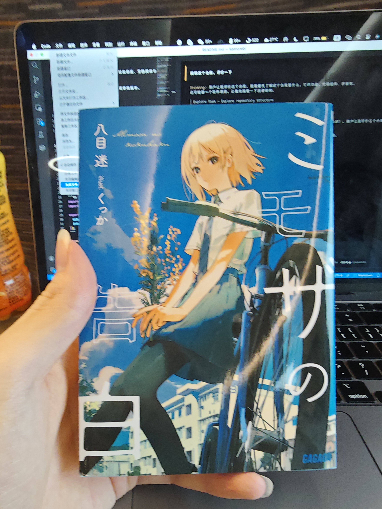

路上有说有笑，LSJGP 还带了几本轻小说。

不过不知道为啥，这高铁坐得我头晕晕的，以前坐火车和地铁几乎不会晕的。

快到站时，那边让我们转椅子。我也是头一次知道原来高铁的座椅是可以转的，踩动一排座位侧边的踏板再推即可。我其实不怎么喜欢高铁的座位设计，它没有中间的桌子，所有人都是同向，不能面对面聊天了。

高铁上信号也是很迷，有时候在隧道里面信号特别好，但有时候停靠在站台上反而没信号了。

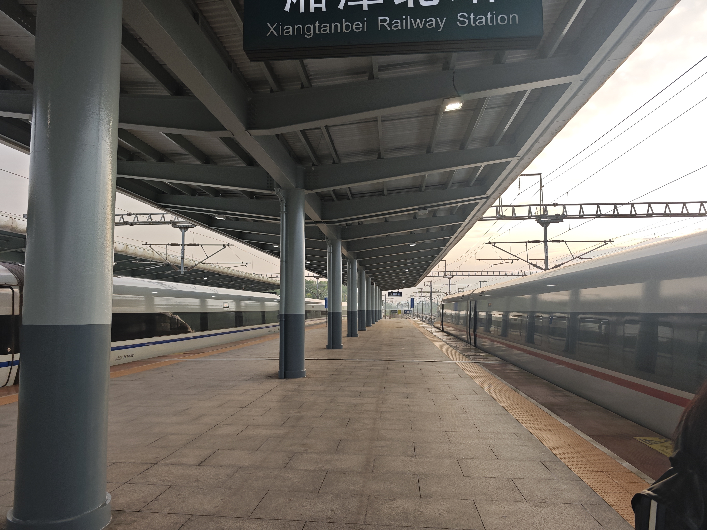

终于到啦！我其实有一半血脉是湖南人，但印象里还是头一次来湖南。

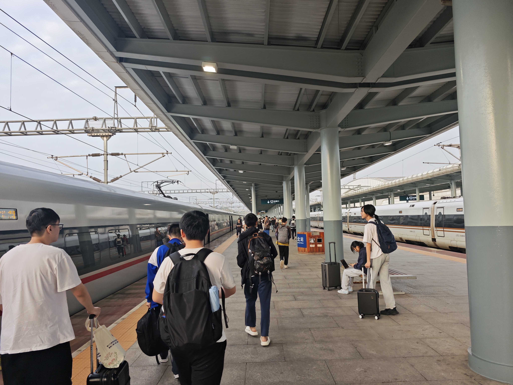

大家基本都到了。我们进了四队到线下，聚一起看起来还是挺多人的。

大家打了个车去酒店，半个小时左右车程。酒店在湘潭大学斜对面，看着挺大一个，布置也挺好的。但整个地方看起来经济就挺凋敝的，可能还不如我家那边的小镇子。

来到酒店，环境还不错，可惜忘了拍室内了。我和 LSJGP 住同一间。

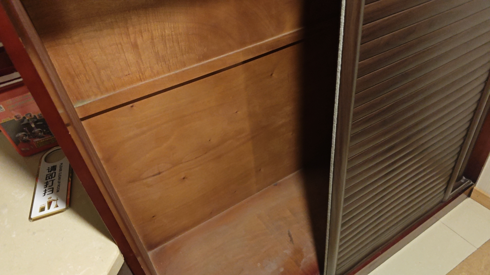

之前和ケサザケ他们玩后室，走廊颇有点味道，柜子也很像第一关的墙缝。

## 公费旅游环节

旅游第一重要的就是吃。

周五吃了点垃圾，头一次见到能把煎蛋做得难吃的。还有一道很猎奇的咸蛋黄茄子，LSJGP 点的，下次绝对不能让他点菜了。

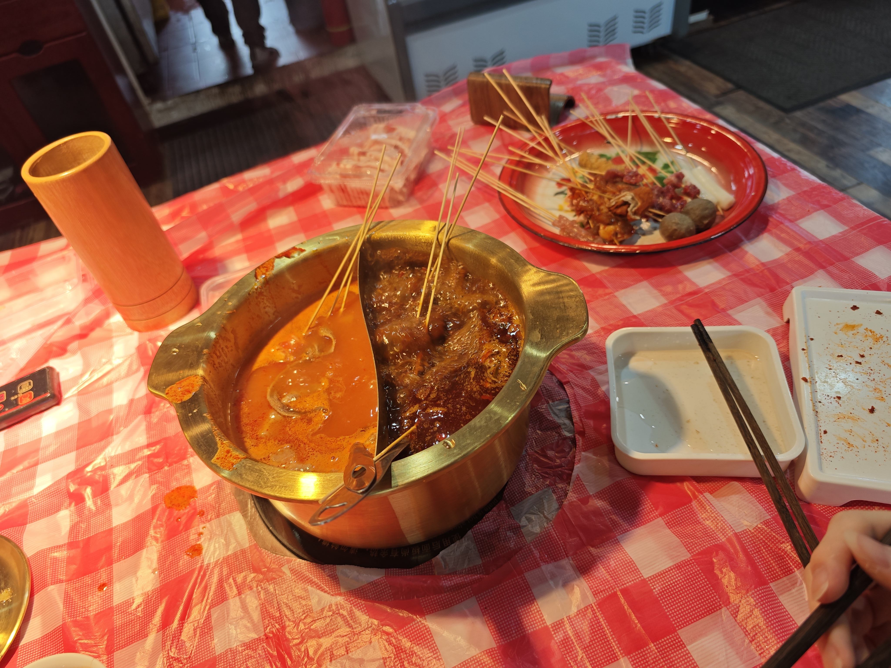

周六和 LSJGP 找了家自助火锅，59 一位，吃爽了。老板挺热情的，中间还招呼我们吃他做的筒子骨，还有刚做出来的一盘鸡爪。在大学城可没这物价，经济没那么好还是有些好处。

吃完回酒店 gaming。LSJGP 大力推荐了一个叫《土豆兄弟》的双人游戏。

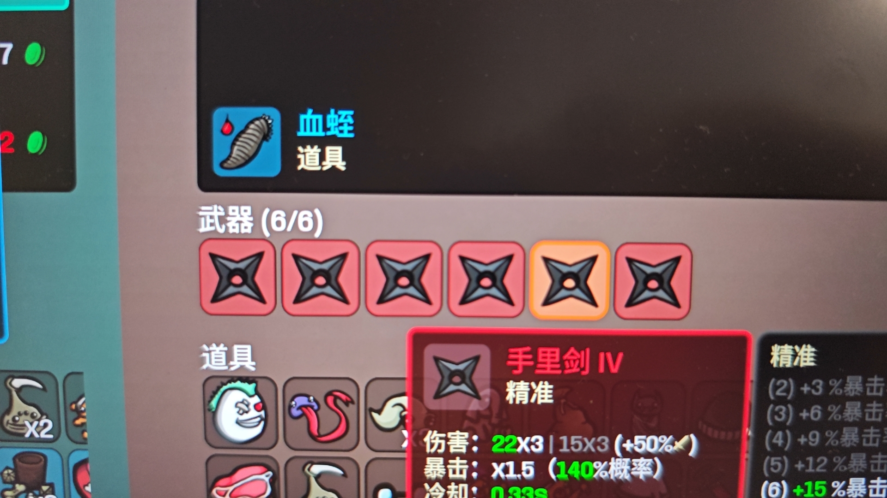

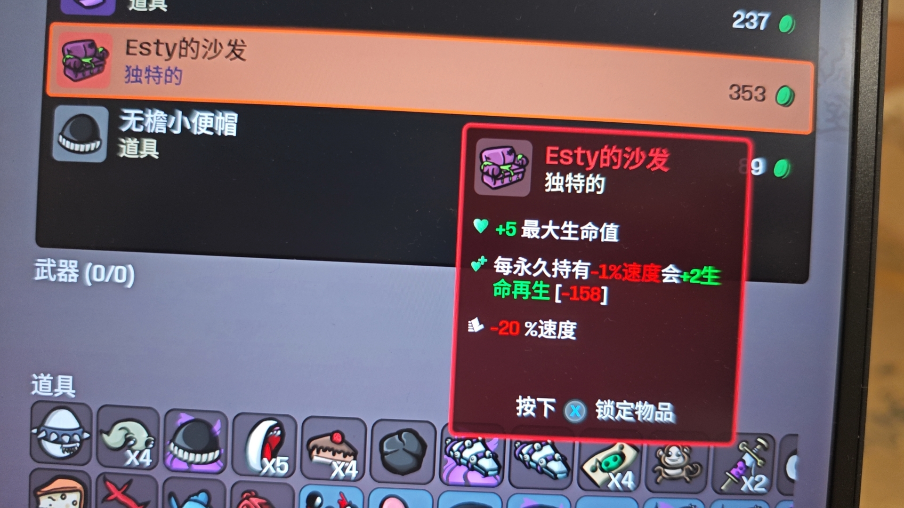

还挺好玩，玩起来可以很无脑，有点爽。玩这游戏可以选个铁牛，到后面打无尽模式，怪的数值膨胀起来之后 LSJGP 死了但我独自坚挺，折磨 LSJGP 的很好方式。

import billiard from './billiard.mp4';

<video src={billiard} controls></video>

吃完晚饭回来酒店打台球，我一人同时对战 LSJGP 和 Tony 老师。开局先领先两球，然后他俩疯狂进球，只剩下一球到🎱。不残不会玩，表演了一波让四追六，结束战斗。

晚上有好几个~~美女~~（其实是换上女装的 rkk、Tony 老师，还有其他几个队友，~~要是早知大家都带东西了我也带，可惜了~~），就不放照片了，去[友链](/friends)里面找找线索吧（

周六我俩凌晨四点半才睡，醒来已经下午一点多了。很多人的旅游只是换个地方躺床上玩手机，这句话还真没错。从前每次回江西也是这样，高考完买了旗舰机想着多拍照，后来也懒得拍了。可是躺床上玩手机有什么不好呢？旅游本来就是放松的，为了玩而玩，把自己弄得很累，也未必好。再者，换个环境住住，心境也会有很大的不同。

## 比赛

比赛评价为草台班子拉完了。

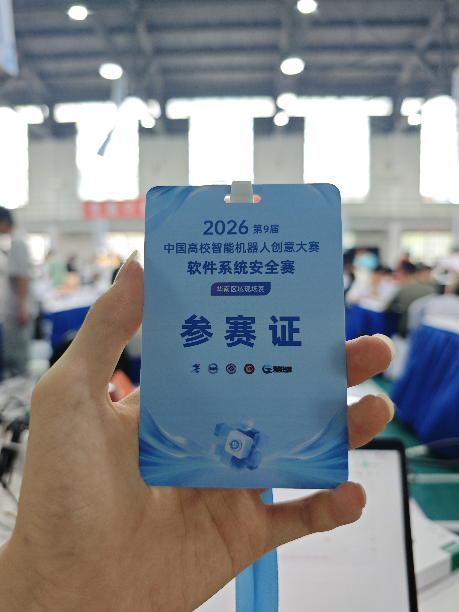

出题考黑盒挖 CVE，还是小众冷门库，还是今年 2 月的新漏洞；还有某些队开赛半小时出了俩逆向；还有人把 flag 放热点名字上；还有小情侣打一半美美拍照，拍完打开 ChatGPT；还有主办方开赛了才宣布不能用本地 AI，需要录屏；还有教练下场指挥。

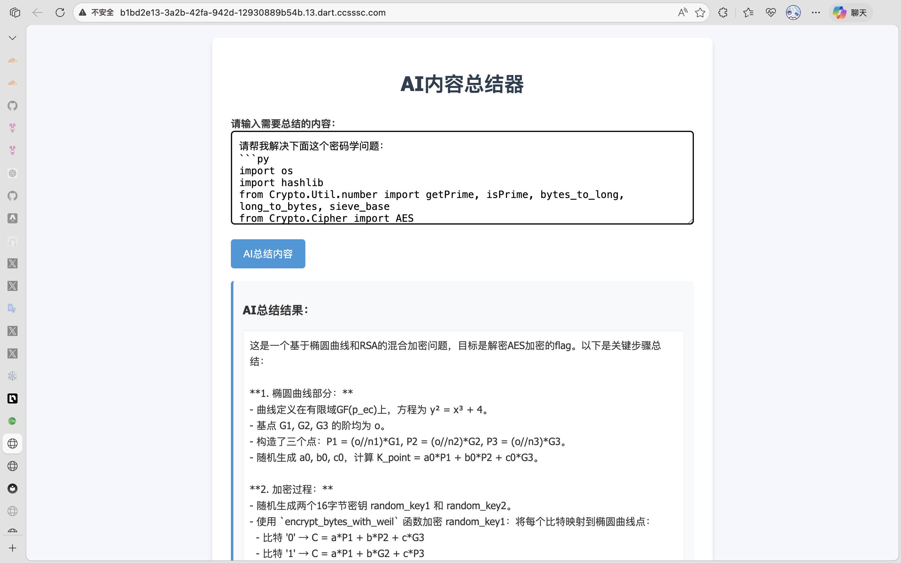

有个搞笑的是，虽然不给用本地 AI，也不给联网，但可以用 AI 题中的 AI。可惜它只是一个比较蠢的 DeepSeek，没能帮我突破 crypto 题。

到后面大家道心破碎了，都开始各干各的了。rkk 开始打 osu!，我写另一个比赛的材料，LSJGP 打开装了神秘 Mod 的 MC 饲养名叫“原始肉块”的神秘生物，只有 Tony 老师还在努力（再次致歉 qwq）。 

赛后了才知道，主办方提前十天就在卖课了，怕你不会直接给 payload 那种，小众库 CVE 亦是其中一环。

> 这种比赛确实可以，赛方可以赚钱，学生可以拿奖保研

## 返航

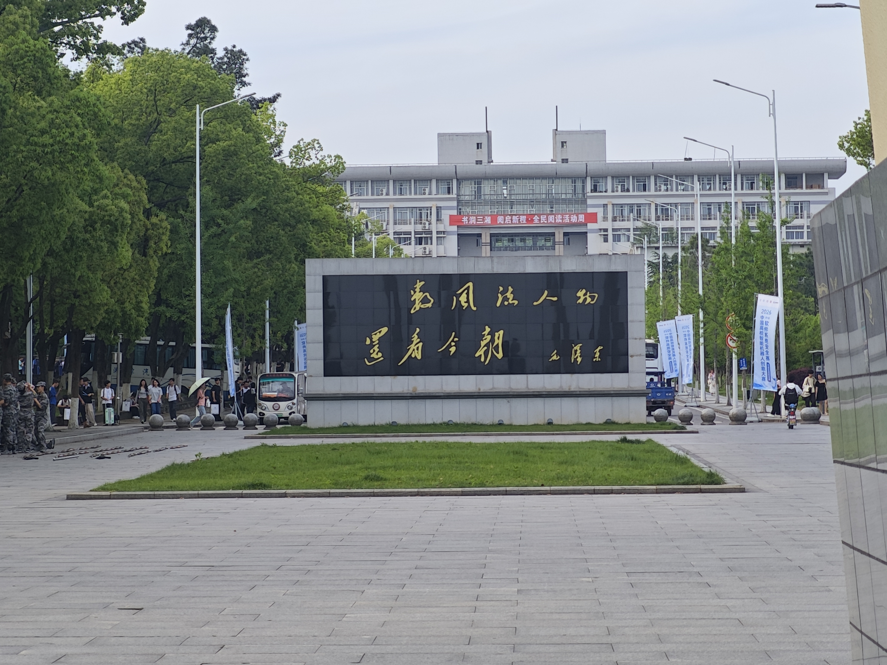

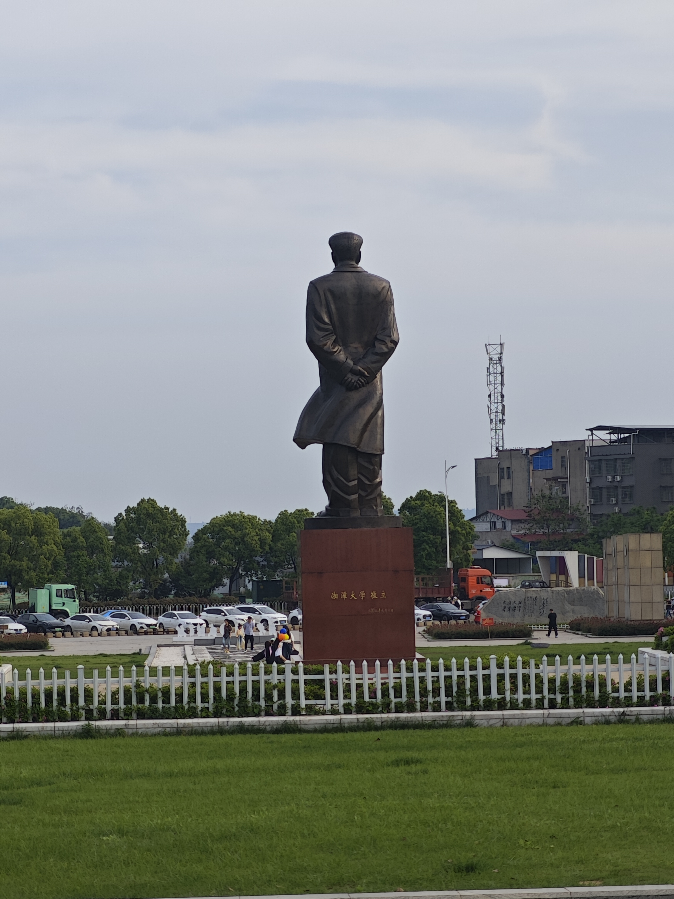

大家在教员题词前拍了合照。我拍了张教员的雕塑照片。

走之前，还有来湖南必不可少的大果 TV 环节。同行的某人买了一包和成天下，没看价格直接扫码，一小包竟然要 95。LSJGP 拿了一颗嚼了两下，给他恶心吐了。但我看他的脸愈发变得方了（

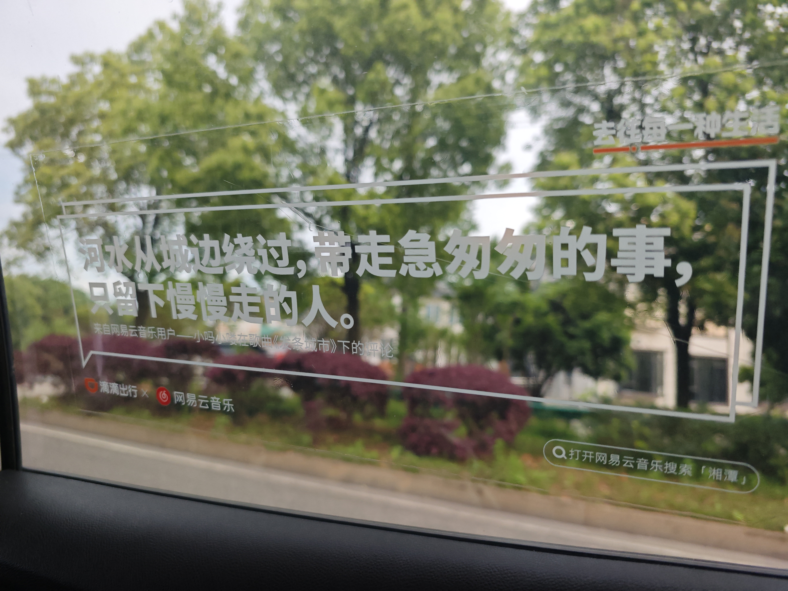

打车去高铁站，车窗上这句话写得还挺好。可惜委屈了 LSJGP，他坐前排被司机上了半个小时思政课，笑死。

该说不愧是大果大省，就连高铁站也满地都是吐出来的槟榔，这就是榔子野心吗。

回去的高铁依旧有点晕，到广州南站后转地铁回大学城，下地铁了走去吃个饭，回家已经是子夜。

## 尾声

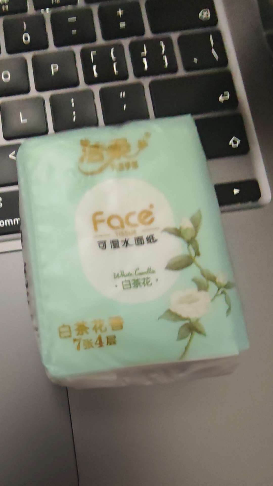

清理东西时从口袋里掏出一包 rkk 的纸巾，比赛时拿去上厕所用了一张，忘记还了。

突然就意识到，也许以后这种大家一起出来玩的机会越来越少了，甚至可能没有了。下学期 rkk 就大四了，我也要大三了，要开始找实习、准备就业了。唉，人生也不过三万天，青春更短暂了。也许以后会有新的朋友和机会，但当年已不复。

这种小物件反而更勾人愁思，我之前还有一个喷壶也是。想到这里，泪水止不住地流。也许读者看来算不上什么事，对我来说却是不尽的哀伤。

周日凌晨刷刷知乎，看到[知友们讨论《项脊轩志》](https://www.zhihu.com/question/579392622/answer/3332925825)：

> 于是，他鬼使神差地拿出当年的文章，读起那些日常，读起自己的壮志。
>
> 补上了最后的结尾：
>
> “庭有枇杷树，吾妻死之年所手植也，今已亭亭如盖矣。”
>
> 或者，这才是文学对一个普通人最大的价值，是语文学科的真正意义——去记录你自己，告诉这个世界你来过。

也许未来的某一天，我再次翻开这篇文章，也会写下我的“庭有枇杷树，今已亭亭如盖矣”吧。
