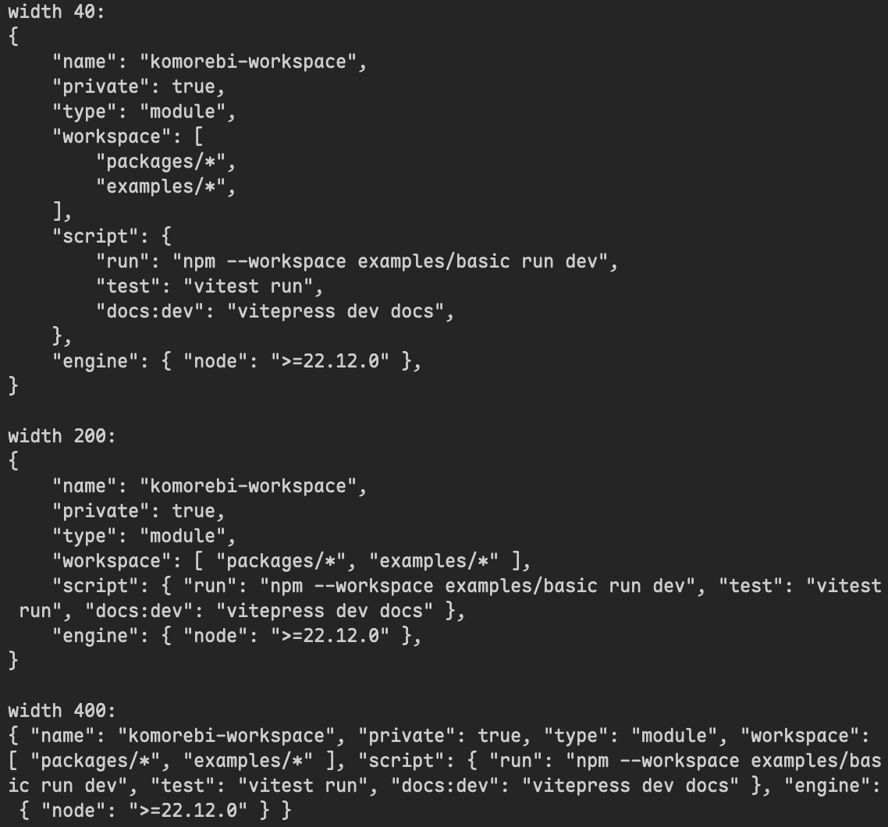

最近在给自己的玩具语言搓 LSP，等 reviewer 行动期间摸个鱼，和 AI 对谈研究了下 formatter，才知道里面大有门道。

逛了圈知乎，似乎没什么人讲这个，只看到一篇简单讲发展历史的：

[pretty printing 简史](https://zhuanlan.zhihu.com/p/80378380)

vibe reading 了 [Wadler 的论文](https://homepages.inf.ed.ac.uk/wadler/papers/prettier/prettier.pdf)之后，我大致懂了基本原理。

## document algebra

Wadler Pretty Printer 的思路是，把文档用代数形式表示出来，从而我们的排版操作可以利用代数性质来做。并且它的代数性质刚好很不错。

以下的表示并不完全和原论文相同，融入了一些我自己的理解和偏好。

给定以下五个基本构造和一个操作：

$$
\begin{aligned}
&\mathbin{<>} &&: \text{Doc} \to \text{Doc} \to \text{Doc} \\
&\text{nil}   &&: \text{Doc}                               \\
&\text{text}  &&: \Sigma^{\ast} \to \text{Doc}             \\
&\text{line}  &&: \text{Doc}                               \\
&\text{nest}  &&: \mathbb{N} \to \text{Doc} \to \text{Doc} \\
&\text{layout}&&: \text{Doc} \to \Sigma^{\ast}             \\
\end{aligned}
$$

其中 $ \mathbin{<>} $ 表示拼接，$ (\text{Doc}, \mathbin{<>}, \text{nil}) $ 构成一个幺半群。

$ \text{text} $ 从字符串构造 $ \text{Doc} $，并且是字符串幺半群到 $ \text{Doc} $ 幺半群的同态：

$$
\begin{aligned}
&\text{text}\ st      &&= \text{text}\ s \mathbin{<>} \text{text}\ t\\
&\text{text}\ \epsilon&&= \text{nil}                                \\
\end{aligned}
$$

$ \text{nest}\ i\ x $ 让 $ x $ 缩进 $ i $ 格。它只在断行处生效，非断行处缩进无效果：

$$
\text{nest}\ i\ (\text{text}\ s) = \text{text}\ s
$$

对 $ \text{nil} $ 缩进无效果：

$$
\text{nest}\ i\ \text{nil} = \text{nil}
$$

缩进 $ 0 $ 格无效果：

$$
\text{nest}\ 0\ x = x
$$

缩进可以叠加：

$$
\text{nest}\ (i + j)\ x = \text{nest}\ i\ (\text{nest}\ j\ x)
$$

缩进对拼接分配：

$$
\text{nest}\ i\ (x \mathbin{<>} y) = \text{nest}\ i\ x \mathbin{<>} \text{nest}\ i\ y
$$

任意 $ \text{Doc} $ 都可经由上述等式规约为如下标准形：

$$
\text{text}\ s_0 \mathbin{<>}
\text{nest}\ i_1\ \text{line} \mathbin{<>}
\text{text}\ s_1 \mathbin{<>} \cdots \mathbin{<>}
\text{nest}\ i_n\ \text{line} \mathbin{<>}
\text{text}\ s_n
$$

证明过程略去。并且这很符合直觉——一个文档就是很多行（不包含缩进）的中间 join 上换行符和缩进。此前我们对每个操作都刻意写出了每种构造的情况，后面我们将如此省略一些可由现有等式推出的性质，读者可自行证明。

$ \text{layout} $ 表示将文档渲染为字符串，同时也是 $ \text{Doc} $ 幺半群到字符串幺半群的同态：

$$
\begin{aligned}
&\text{layout}\ (x \mathbin{<>} y)&&= (\text{layout}\ x)(\text{layout}\ y)\\
&\text{layout}\ (\text{text}\ s)  &&= s                                   \\
\end{aligned}
$$

缩进会在断行处后添加对应数量的空格：

$$
\text{layout}\ (\text{nest}\ i\ \text{line}) = \text{换行符}\ \underbrace{\text{空格}\cdots\text{空格}}_{i\text{ 次}}
$$

我们都知道 formatter 可以根据最大宽度选择布局，而上面的构造不具备这种能力。接下来我们引入两个新的构造和一个变换：

$$
\begin{aligned}
&\mathbin{<|>}  &&: \text{Doc} \to \text{Doc} \to \text{Doc}\\
&\text{flatten} &&: \text{Doc} \to \text{Doc}               \\
&\text{group}   &&: \text{Doc} \to \text{Doc}               \\
\end{aligned}
$$

$ \text{flatten}\ x $ 表示将 $ x $ 中的换行压成空格：

$$
\begin{aligned}
&\text{flatten}\ (x \mathbin{<>} y) &&= \text{flatten}\ x \mathbin{<>} \text{flatten}\ y\\
&\text{flatten}\ \text{text}\ s     &&= \text{text}\ s                                  \\
&\text{flatten}\ \text{line}        &&= \text{text}\ \text{空格}                        \\
&\text{flatten}\ (\text{nest}\ i\ s)&&= \text{flatten}\ s                               \\
\end{aligned}
$$

$ \mathbin{<|>} $ 表示多个布局中选择一个，有：

$$
\begin{aligned}
(x \mathbin{<|>} y) \mathbin{<>} z  &= (x \mathbin{<>} z) \mathbin{<|>} (y \mathbin{<>} z)\\
x \mathbin{<>} (y \mathbin{<|>} z)  &= (x \mathbin{<>} y) \mathbin{<|>} (x \mathbin{<>} z)\\
\text{nest}\ i\ (x \mathbin{<|>} y) &= \text{nest}\ i\ x \mathbin{<|>} \text{nest}\ i\ y  \\
\end{aligned}
$$

此外，对于 $ x \mathbin{<|>} y $，还应该满足两个不变式：

1. $ \text{flatten}\ (x \mathbin{<|>} y) = \text{flatten}\ x = \text{flatten}\ y $
2. $ x $ 中所有候选的第一行都不短于 $ y $ 的第一行

这使得在选择布局时可以从左往右依次尝试布局。

在一些改进（如 Daan Leijen 的 `wl-pprint`）中，引入了一个永远失败的 $ \text{Doc} $ 构造 $ \text{fail} $，并规定 $ \text{fail} \mathbin{<|>} x = x \mathbin{<|>} \text{fail} = x $，从而使得 $ (\text{Doc}, \mathbin{<|>}, \text{fail}) $ 构成一个幺半群。但这已超出 Wadler 原始论文和本文的讨论范围，不过多赘述。

$ \text{group}\ x $ 意味着，如果 $ x $ 能用一行表示，那就压平：

$$
\text{group}\ x = \text{flatten}\ x \mathbin{<|>} x
$$

$ \text{layout} $ 操作并不处理 $ \mathbin{<|>} $ 构造，我们会先消解布局选择再渲染：

$$
\begin{aligned}
&\text{fits}  &&: \mathbb{Z} \to \text{Doc} \to \mathbb{B}                \\
&\text{best}  &&: \mathbb{N} \to \mathbb{N} \to \text{Doc} \to \text{Doc} \\
&\text{pretty}&&: \mathbb{N} \to \text{Doc} \to \Sigma^{\ast}             \\
\end{aligned}
$$

$ \text{fits} $ 只检查当前布局的第一行能否放进剩余宽度 $ r $：

$$
\begin{aligned}
&\text{fits}\ r\ x                                            &&= \bot && \text{if}\ r < 0            \\
&\text{fits}\ r\ \text{nil}                                   &&= \top                                \\
&\text{fits}\ r\ (\text{text}\ s \mathbin{<>} x)              &&= \text{fits}\ (r - \lvert s \rvert) x\\
&\text{fits}\ r\ (\text{nest}\ i\ \text{line} \mathbin{<>} x) &&= \top                                \\
\end{aligned}
$$

$ \text{best} $ 则消去 $ \mathbin{<|>} $：

$$
\begin{aligned}
&\text{best}\ w\ k\ \text{nil}                                  &&= \text{nil}                                                          \\
&\text{best}\ w\ k\ (\text{text}\ s \mathbin{<>} x)             &&= \text{text}\ s \mathbin{<>} \text{best}\ w (k + \lvert s \rvert)\ x \\
&\text{best}\ w\ k\ (\text{nest}\ i\ \text{line} \mathbin{<>} x)&&= \text{nest}\ i\ \text{line} \mathbin{<>} \text{best}\ w\ i\ x       \\
&\text{best}\ w\ k\ (x \mathbin{<|>} y)                         &&= \begin{cases}
  \text{best}\ w\ k\ x & \text{if}\ \text{fits}\ (w-k)\ (\text{best}\ w\ k\ x)\\
  \text{best}\ w\ k\ y & \text{otherwise}                                     \\
\end{cases}
\end{aligned}
$$

最后，显然有：

$$
\text{pretty}\ w\ x = \text{layout}\ (\text{best}\ w\ 0\ x)
$$

## 简单的例子

由于我不会任何函数式语言，所以使用 sum type 体验较为舒适的 Rust。

接下来我们实现一个带 optional tail comma 扩展的 JSON formatter，[源码已上传 GitHub](https://github.com/KeqingMoe/doc-alg)。

定义 Doc IR：

```rs
#[derive(Debug, Clone)]
enum Doc {
  Nil,
  Text(String),
  // 断行点：
  // - flat 模式下输出 `flat`
  // - broken 模式下输出 `broken`，然后换行并缩进
  Break { flat: String, broken: String },
  Concat(Vec<Doc>),
  Nest(usize, Box<Doc>),
  Union(Box<Doc>, Box<Doc>),
}

fn nil() -> Doc {
  Doc::Nil
}

fn text(s: impl Into<String>) -> Doc {
  Doc::Text(s.into())
}

fn concat(docs: impl IntoIterator<Item = Doc>) -> Doc {
  let mut out = Vec::new();

  for doc in docs {
    match doc {
      Doc::Nil => {}
      Doc::Concat(docs) => out.extend(docs),
      doc => out.push(doc),
    }
  }

  match out.len() {
    0 => Doc::Nil,
    1 => out.pop().unwrap(),
    _ => Doc::Concat(out),
  }
}

fn break_with(flat: impl Into<String>, broken: impl Into<String>) -> Doc {
  Doc::Break {
    flat: flat.into(),
    broken: broken.into(),
  }
}

// Wadler 的 `line`：
// - flat 时变成一个空格
// - broken 时真正换行
fn line() -> Doc {
  break_with(" ", "")
}

impl Doc {
  fn append(self, other: Doc) -> Doc {
    concat([self, other])
  }

  fn nest(self, indent: usize) -> Doc {
    Doc::Nest(indent, Box::new(self))
  }

  fn group(self) -> Doc {
    Doc::Union(Box::new(self.flatten()), Box::new(self))
  }
}
```

起初，我做了一个 `TailComma` 变体，但询问 AI 后，被建议与 `Line` 变体合并，统一成更通用的 `Break { flat, broken }` 变体。

`flatten` 操作：

```rs
impl Doc {
  fn flatten(&self) -> Doc {
    match self {
      Doc::Nil => nil(),
      Doc::Text(s) => text(s.clone()),
      Doc::Break { flat, .. } => text(flat.clone()),
      Doc::Concat(docs) => concat(docs.iter().map(Doc::flatten)),
      Doc::Nest(_, doc) => doc.flatten(),
      Doc::Union(flat, _) => flat.flatten(),
    }
  }
}
```

渲染：

```rs
fn render(out: &mut impl Write, width: usize, doc: &Doc) -> Result<(), fmt::Error> {
  let mut col = 0;
  let mut stack = vec![(0usize, doc)];

  while let Some((indent, doc)) = stack.pop() {
    match doc {
      Doc::Nil => {}
      Doc::Text(s) => {
        write!(out, "{s}")?;
        col += display_width(s);
      }
      Doc::Break { broken, .. } => {
        writeln!(out, "{broken}")?;
        for _ in 0..indent {
          out.write_char(' ')?;
        }
        col = indent;
      }
      Doc::Concat(docs) => {
        stack.extend(docs.iter().rev().map(|doc| (indent, doc)));
      }
      Doc::Nest(extra, doc) => {
        stack.push((indent + extra, doc));
      }
      Doc::Union(flat, broken) => {
        let fit = width
          .checked_sub(col)
          .map(|remaining| fits(remaining, flat))
          .unwrap_or(false);

        stack.push((indent, if fit { flat } else { broken }));
      }
    }
  }

  Ok(())
}

// Wadler 风格的 fits：
// 只检查“当前这一行”还能不能放下。
fn fits(mut remaining: usize, doc: &Doc) -> bool {
  let mut stack = vec![doc];

  while let Some(doc) = stack.pop() {
    match doc {
      Doc::Nil => {}
      Doc::Text(s) => match remaining.checked_sub(display_width(s)) {
        Some(new) => remaining = new,
        None => return false,
      },
      Doc::Break { .. } => return true,
      Doc::Concat(docs) => {
        for doc in docs.iter().rev() {
          stack.push(doc);
        }
      }
      Doc::Nest(_, doc) => {
        stack.push(doc);
      }
      Doc::Union(flat, _) => {
        stack.push(flat);
      }
    }
  }

  true
}

fn display_width(s: &str) -> usize {
  // 这里只假设输入全是 ASCII。
  // 真要做严谨的显示宽度，请用 unicode-width 之类的库。
  s.len()
}

impl Display for Doc {
  fn fmt(&self, f: &mut std::fmt::Formatter<'_>) -> std::fmt::Result {
    let width = f.width().unwrap_or(80);
    render(f, width, self)
  }
}
```

JSON formatter：

```rs
fn join(docs: impl IntoIterator<Item = Doc>, sep: Doc) -> Doc {
  let mut iter = docs.into_iter();
  let Some(mut r) = iter.next() else {
    return nil();
  };

  for doc in iter {
    r = r.append(sep.clone()).append(doc)
  }

  r
}

// 这个断行点用于尾逗号：
// - flat 时负责右括号前的那个空格
// - broken 时输出 `,`，然后换行
fn tail_comma() -> Doc {
  break_with(" ", ",")
}

fn kv(k: impl ToString, v: Doc) -> Doc {
  concat([str(k), text(": "), v]).group()
}

fn delim(
  left: impl Into<String>,
  items: impl IntoIterator<Item = Doc>,
  right: impl Into<String>,
) -> Doc {
  let left = text(left.into());
  let right = text(right.into());

  let items: Vec<_> = items.into_iter().collect();
  if items.is_empty() {
    return concat([left, right]);
  }

  let body = join(items, concat([text(","), line()]));

  concat([left, concat([line(), body]).nest(4), tail_comma(), right]).group()
}

fn arr(items: impl IntoIterator<Item = Doc>) -> Doc {
  delim("[", items, "]")
}

fn obj(items: impl IntoIterator<Item = Doc>) -> Doc {
  delim("{", items, "}")
}

fn str(x: impl ToString) -> Doc {
  text(format!("{:?}", x.to_string()))
}
```

最终，试着打印一段 `package.json` 的内容（源自[我的 Blog 主题](https://github.com/KeqingMoe/komorebi)）：

```rs
fn main() {
  let doc = obj([
    kv("name", str("komorebi-workspace")),
    kv("private", text("true")),
    kv("type", str("module")),
    kv("workspace", arr([str("packages/*"), str("examples/*")])),
    kv(
      "script",
      obj([
        kv("run", str("npm --workspace examples/basic run dev")),
        kv("test", str("vitest run")),
        kv("docs:dev", str("vitepress dev docs")),
      ]),
    ),
    kv("engine", obj([kv("node", str(">=22.12.0"))])),
  ]);

  println!("width 40:");
  println!("{doc:40}");
  println!();

  println!("width 200:");
  println!("{doc:200}");
  println!();

  println!("width 400:");
  println!("{doc:400}");
}
```

最终效果：



看起来还是不错的！

当然，要把这套理论用来给一个编程语言做 formatter 还远远不够，还请读者自行探索学术界和工业界的实践吧。
